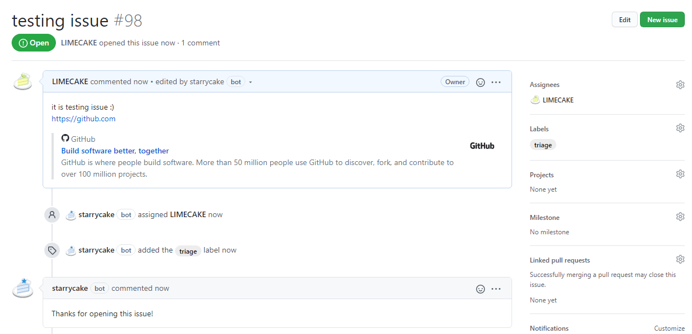

<h1 align="center">
  
  <br>
  <p>StarryCake</p>
</h1>

<p align="center">
    <a href="https://github.com/apps/starrycake">
        
    </a>
    <a href="#license">
        
    </a>
    <a href="https://github.com/LIMECAKE/StarryCake/releases">
        
    </a>
    <a href="https://github.com/LIMECAKE/StarryCake/issues">
        
    </a>
</p>

<p align="center">
StarryCake is a Multiple-feature-combined GitHub Bot Application  
</p>

## Usage
[Add this GitHub App to your account!](https://github.com/apps/starrycake)

## Implemented Features

### Assigner
[LimeCake](https://github.com/LIMECAKE)  
Auto assigns owner on new issues and pull requests

### Responder
[LimeCake](https://github.com/LIMECAKE)  
Automatically respond on new issues and pull requests as you configured

### Delete Merged Branch
https://github.com/SvanBoxel/delete-merged-branch  
[Sebass van Boxel](https://github.com/SvanBoxel)  
A GitHub app that automatically deletes a branch after it's merged

### Stale
https://github.com/probot/stale  
[Brandon Keepers](https://github.com/bkeepers)  
Close stale Issues and Pull Requests

### Todo
https://github.com/JasonEtco/todo  
[Jason Etcovitch](https://github.com/JasonEtco)  
Creates new issues from actionable comments in your code

### Reminders
https://github.com/probot/reminders  
[Jamie Jones](https://github.com/jbjonesjr) [Brandon Keepers](https://github.com/bkeepers)  
Set reminders on Issues and Pull Requests

### Unfurl Links
https://github.com/probot/unfurl  
[Brandon Keepers](https://github.com/bkeepers)  
Add context to the links shared in discussions

### Triage New Issues
https://github.com/tunnckoCore/triage-new-issues  
[Charlike Mike Reagent](https://github.com/tunnckoCore)  
Adds `triage` label to newly-created issues and then removes it when other label(s) are added

## Configuration
create `.github/starrycake.yml` in your repository to make this application work on your order!
```yml
## MASTER APPLICATION CONFIG
starrycake:
  # if false, application's every feature won't work
  moduleSwitch: true

## ASSIGNER
assigner:
  # if false, ASSIGNER module won't work
  moduleSwitch: true
  # assign on new issue?
  assignOnNewIssue: true
  # assign on new pull request?
  assignOnNewPullRequest: true
  # review on new pull request?
  reviewOnNewPullRequest: true

## DELETE-MERGED-BRANCH
deletebranch:
  # if false, DELETE-MERGED-BRANCH module won't work
  moduleSwitch: true
  # list of branches that should not be automatically deleted after a merge. Wildcards supported.
  exclude:
    - dev-*
  # whether or not a branch should be deleted if PR is closed without merging
  delete_closed_pr: true

## REMINDER
reminder:
  # if false, REMINDER module won't work
  moduleSwitch: true

## RESPONDER
responder:
  # if false, RESPONDER module won't work
  moduleSwitch: true
  # respond on new issue?
  respondOnNewIssue: true
  # respond on new pull request?
  respondOnNewPullRequest: true
  # respond on my new issue?
  respondOnMyIssue: false
  # respond on my new pull request?
  respondOnMyPullRequest: false
  # issue respond message string
  issueRespond: Thanks for opening this issue!
  # pull request respond message string
  pullRequestRespond: Thanks for opening this pull request!

## STALE
stale:
  # if false, STALE module won't work
  moduleSwitch: true
  # Number of days of inactivity before an Issue or Pull Request becomes stale
  daysUntilStale: 60
  # Number of days of inactivity before a stale Issue or Pull Request is closed. If disabled, issues still need to be closed manually, but will remain marked as stale.
  daysUntilClose: 7
  # Issues or Pull Requests with these labels will never be considered stale. Set to `[]` to disable
  exemptLabels:
    - pinned
    - security
  # Label to use when marking as stale
  staleLabel: wontfix
  # Comment to post when marking as stale. Set to `false` to disable
  markComment: >
    This issue has been marked as stale. It will be closed if no further activity occurs.
  # Comment to post when closing a stale Issue or Pull Request. Set to `false` to disable
  closeComment: false

## TO-DO
todo:
  # if false, TO-DO module won't work
  moduleSwitch: true
  # If `true`, it'll assign whoever pushed the code. If a string, it'll assign that user by username. `false` to not assign anyone.
  autoAssign: true
  # The keyword(s) to use to generate issue titles
  keyword: ['@todo', 'TODO']
  # If this is in the line right after the main keyword, it will become the generated issue body.
  bodyKeyword: ['@body', 'BODY']
  # The number of lines of code to show, starting from the keyword.
  blobLines: 5
  # Should the keyword be case sensitive?
  caseSensitive: false
  # If true, add the `todo` label. If false, don't add any label.You can also give it a label name or an array of label names.
  label: true
  # If an issue already exists and is closed, reopen it. If set to false, no new issue will be created.
  reopenClosed: true
  # Exclude certain files and/or directories. Should be a valid regular expression.
  exclude: null

## TRIAGE-NEW-ISSUES
triage:
  # if false, TRIAGE-NEW-ISSUES module won't work
  moduleSwitch: true
  # the label name triage module uses
  triageLabel: triage

## UNFURL
unfurl:
  # if false, UNFURL module won't work
  moduleSwitch: true
```

## ScreenShots

<div align="center">
</img>
</div>

## License
[ISC](LICENSE) © 2020 LimeCake <limecake23@gmail.com>
